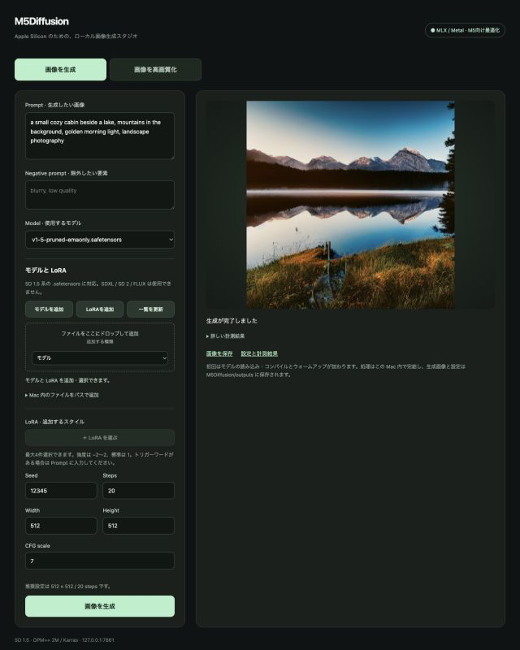

# M5Diffusion

Fast local image generation for Apple Silicon, powered by MLX and Metal.

**Experimental alpha · SD1.5 · local Web UI + image upscaling.** Built and primarily tested on MacBook Air M5 / 24GB Unified Memory.

**[Download v0.1.0-alpha](https://github.com/shin9314/M5Diffusion/releases/tag/v0.1.0-alpha)** · [Installation](INSTALL.md) · [Launch facts & demo guide](docs/LAUNCH.md)

Apple Silicon · macOS 26+ · 16GB+ memory. **Not Developer ID signed or notarized.** Model weights are separate; import a licensed SD1.5 checkpoint in the UI.

## A measured snapshot

SD1.5 · 512×512 · 20 steps · CFG 7 · seed 12345 · DPM++ 2M Karras, on M5 Air / 24GB.

| Controlled MLX A/B | Warm diffusion median |
|---|---:|
| Native convolution | 7.486 s |
| Selective im2col + MLX matmul | **6.025 s** |

**1.23× median paired improvement** across three sessions; optimized total generation median **6.822 s**. Performance varies with thermal state, system load, model configuration and hardware. [Methodology, quality checks and limitations →](BENCHMARKS.md)

## See it working

<table><tr><td width="58%"></td><td width="42%"></td></tr></table>

Actual Web UI and SD1.5 output. The current UI is Japanese. No cloud inference; no model weights are bundled.

## Try it

1. Download the DMG from the [alpha Release](https://github.com/shin9314/M5Diffusion/releases/tag/v0.1.0-alpha).
2. Open it, move **M5Diffusion.app** to Applications, and launch.
3. Import a licensed SD1.5 `.safetensors` model, enter a prompt, and generate. Or select **画像を高画質化** to upscale an uploaded image.

Save the result as PNG. Quit the app to stop the local server. The app includes a private runtime; no Homebrew, system-Python modification or sudo. See [INSTALL.md](INSTALL.md) for source setup, trusted-download/Gatekeeper guidance and troubleshooting.

## Features

- MLX-native SD1.5 generation with prompt, negative prompt, seed, steps, CFG and image dimensions.
- Selective optimized UNet convolution, padded fused attention and compiled diffusion steps; DPM++ 2M Karras sampling.
- Model import and [limited standard SD1.x LoRA support](docs/lora.md).
- Separate Real-ESRGAN image upscaling: 2×/4×, transparency, before/after preview and PNG saving.
- Local execution and a reproducible benchmark framework. [Web UI](docs/UI.md) · [Upscaler details](docs/upscale.md).

## Architecture

The app launcher manages a local FastAPI service and private writable data. The service loads the MLX engine for diffusion or Torch MPS for Real-ESRGAN. GPU jobs run serially. Adapted Apple MLX reference modules provide the SD1.5 model structure; the accepted attention/convolution paths keep all pixels, tokens and sampling steps. Allocator limits and schedule metadata reuse are not a manually managed activation workspace.

## Known limitations

SD1.5 only; **SDXL, FLUX and ControlNet are unsupported**. LoRA support is limited to the documented standard SD1.x formats. Apple Silicon only; M1–M4 and other memory configurations are not validated. Fanless thermal behavior and background applications can change performance. This remains research/alpha software, with unsigned distribution and incomplete broad compatibility testing.

## Development, roadmap and license

Read [CONTRIBUTING.md](CONTRIBUTING.md), [ROADMAP.md](ROADMAP.md), and [CHANGELOG.md](CHANGELOG.md). No competitor results are published; the proposed fair-comparison protocol is [documented separately](docs/competitive-benchmark.md).

Original project code is [MIT licensed](LICENSE). Adapted Apple code retains MIT notices; Real-ESRGAN code retains BSD-3-Clause notices. Dependencies and model weights have their own terms; see [third-party inventory](docs/third-party-licenses.md). The application license does not relicense checkpoints or LoRAs.

Provided as-is, without warranty. Use only images and model weights you have permission to use. Reconstructed details may be plausible rather than faithful to an original scene. This project is not affiliated with or endorsed by Apple, Stability AI, or the upstream model authors.
